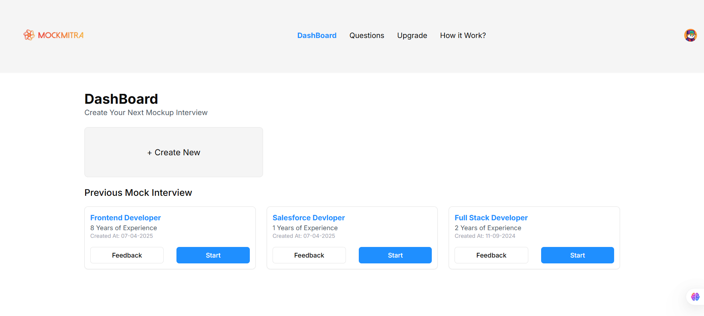
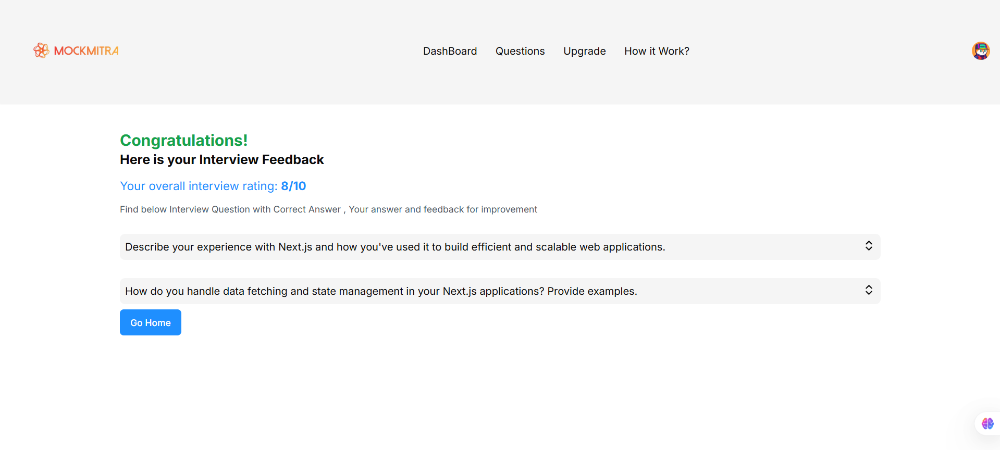

# MockMitra 🎤🧠

**MockMitra** is an AI-powered platform designed to help individuals prepare for interviews by providing realistic mock interview experiences. Leveraging advanced AI technologies, MockMitra simulates interview scenarios, offering personalized feedback to enhance users' performance and confidence.

---

## 🚀 Features

- 🤖 **AI-Powered Mock Interviews**: Engage in simulated interviews tailored to your chosen field and experience level.
- ⚡ **Real-Time Feedback**: Receive instant, constructive feedback on your responses to improve your interview skills.
- 🎯 **Customizable Scenarios**: Select from a variety of industries and roles to practice relevant interview questions.
- 📈 **Performance Tracking**: Monitor your progress over time with detailed analytics and insights.

---

## 🛠️ Tech Stack

### Frontend  
<p>
  
  
</p>

### Backend  
<p>
  
  
</p>

### Database  
<p>
  
</p>

### AI Integration  
<p>
  
</p>


## 📸 Screenshots

| Homepage | Feedback Summary |
|----------|------------------|------------------|
| ![Homepage] | ![Feedback]  |

---

## 🧑‍💻 Getting Started

To set up MockMitra locally, follow these steps:

1. **Clone the Repository**:

   ```bash
   git clone https://github.com/GeeekySouro003/MockMitra.git

2. **Navigate to the Project Directory**:

   ```bash
   cd MockMitra

3. **Install Dependencies**:
   ```bash
   npm install

4. **Set Up Environment Variables**:
   ## Create a .env file in the root directory and add the following:
   OPENAI_API_KEY=your_openai_api_key
   MONGODB_URI=your_mongodb_connection_string

5. **Run the Development Server**:
     npm run dev

## The application will be running at http://localhost:3000.


## 🤝 Contributing

We welcome contributions to MockMitra and appreciate your interest in improving the platform!

To contribute:

1. **Fork the Repository**:
Click the Fork button at the top right of this page to create your own copy of the repository.

2. **Clone Your Fork Locally**:
git clone https://github.com/your-username/MockMitra.git
cd MockMitra.

3. **Create a New Branch**:
git checkout -b feature/your-feature-name

4. **Make Your Changes**:
git commit -m "Add: meaningful commit message describing your change"

5. **Push to Your Fork**:
git push origin feature/your-feature-name

6. **Open a Pull Request**:
Go to your forked repository on GitHub and open a pull request to the main branch of the original repository.


## Please make sure your code follows the project’s coding style and includes test coverage or documentation updates where necessary.

## Made with ❤️ by Souradip Dasgupta